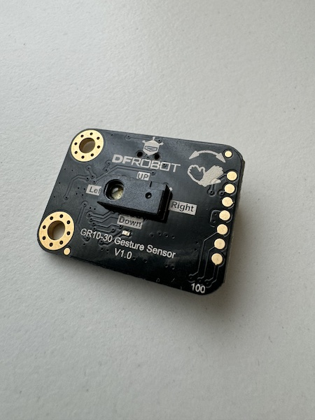

# MicroPython I2C library and example for Gravity: GR10-30 Gesture Sensor

This repository contains the MicroPython I2C library for the Gravity: GR10-30 Gesture Sensor from DFRobot, as well as a very simple example of how to use it. The original repository from DFRobot is located [here](https://github.com/cdjq/DFRobot_GR10_30) (_for Arduino and Raspberry Pi_).

## Why this repository?

The original version of DFRobot uses Python serial (_UART_) and Python SMBus (_I2C_), which are not compatible with MicroPython. Also, I was not so happy with the Python code style/quality. That's why I created this version.

## Prerequisite

- [Gravity: GR10-30 Gesture Sensor](https://www.dfrobot.com/product-2666.html?tracking=Mszf2HlGMStAAKkFfhNgg3QhFFchlilhR47u9vXX9o9Ko6giJYRJQdmwZjbDIvMV)
- ESP32 (_MicroPython compatible device_)
- MicroPython firmware installed (_min. 1.20.0.*_)
- USB cable (_for connection between ESP32 and sensor_)
- latest [VCP](https://www.silabs.com/developers/usb-to-uart-bridge-vcp-drivers?tab=downloads) driver installed



## Installation

Clone this repository to your local computer.

```shell
# clone repository
$ git clone https://github.com/Lupin3000/Micropython-I2C-GR10_30.git

# change into local repository folder
$ cd Micropython-I2C-GR10_30/
```

You can optionally install other helpful Python packages.

- esptool (_to flash the MicroPython firmware to the ESP32_)
- rshell (_to establish a serial connection between the local computer and the ESP32 and to transfer data_)
- micropython-esp32-stubs (_to facilitate local development, for example: code completion_)

```shell
# install python packages (optional)
$ pip install -r requirements.txt
```

Connect the sensor to the ESP32. Make sure that you have set the communication mode on the sensor to I2C and use the correct connections (_ESP GPIO's/Sensor interface_)! Only then connect the ESP32 to your local computer via USB.

> In the example `main.py`, the GPIOs pins 21 (_SDA_) and 22 (_SCL_) are used. However, you can adapt these to your needs at any time.

Then start the serial connection and load the example and the library onto the ESP32 device.

```shell
# start rshell connection
$ rshell -p /dev/cu.usbserial-0001

# upload files and folder
/YOUR/LOCAL/PATH> cp main.py /pyboard/
/YOUR/LOCAL/PATH> cp -r lib/ /pyboard/
```

> The example device/path `/dev/cu.usbserial-0001` could be different for you! Please adapt before your execute the commands!

## Usage

```shell
# start the Python REPL
/YOUR/LOCAL/PATH> repl
```

Now press the keys `CTRL` + `d` on your local device, to trigger the soft-reset of the ESP32. If there are no errors, you should see the string "Start hand gestures:" in the terminal after a very short time.

```python
Entering REPL. Use Control-X to exit.
>
MicroPython v1.20.0 on 2023-04-26; ESP32 module with ESP32
Type "help()" for more information.
>>> 
>>> 
MPY: soft reboot
Sensor initialized
Start hand gestures:
```

Now move your hand or just fingers in front of the sensor. Here few examples:

```python
Gesture: 4 left
Gesture: 8 right
Gesture: 1 up
Gesture: 2 down
Gesture: 32768 counter clockwise continues
Gesture: 32768 counter clockwise continues
Gesture: 16384 clockwise continues
Gesture: 16384 clockwise continues
```

Additional information:

- [DFRobot: Product Wiki](https://wiki.dfrobot.com/SKU_SEN0561_Gravity_GR10_30_Gesture_Sensor)
